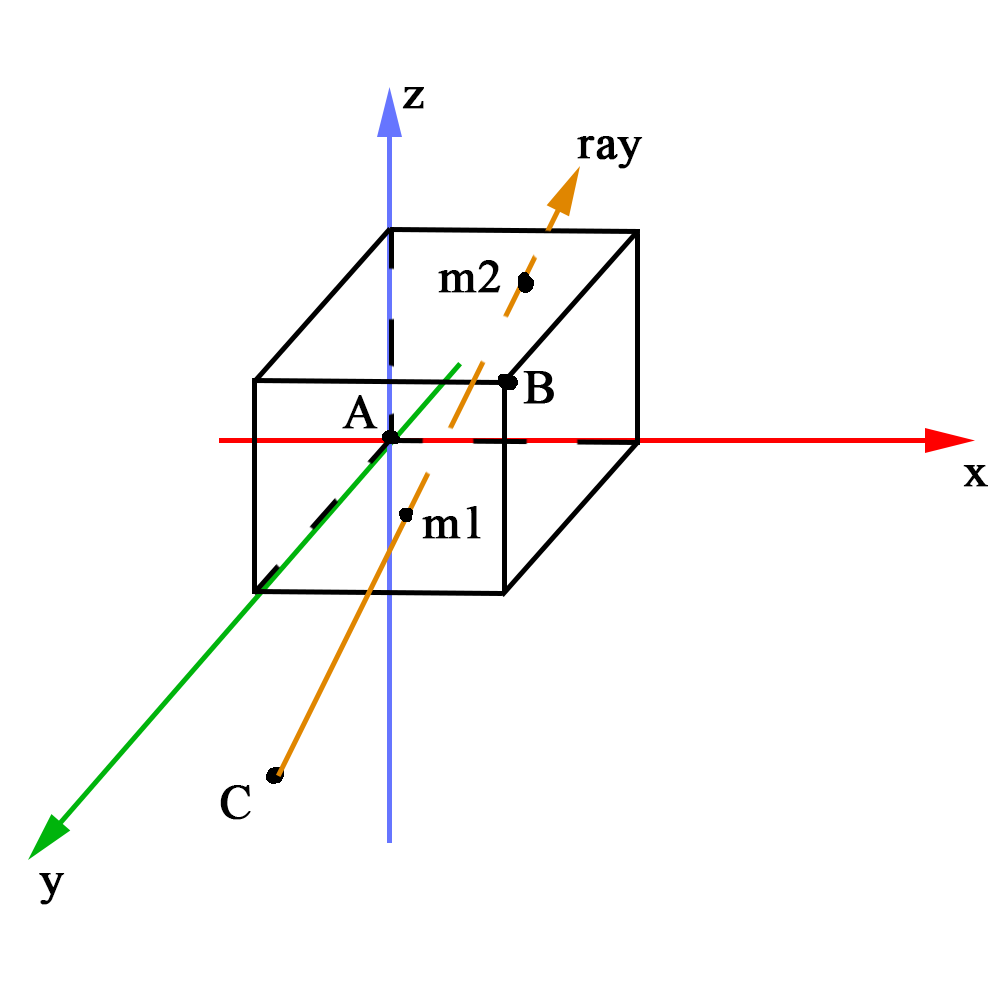
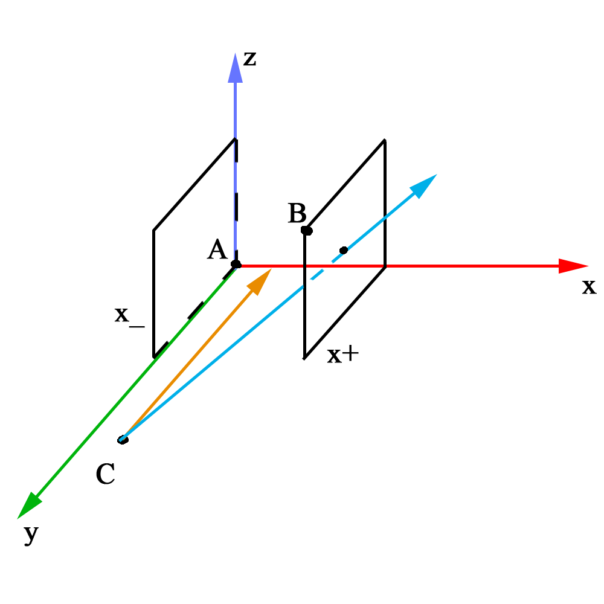

# Результат


# Компиляция

```
g++ -Wall -lm -lncurses ray_tracing.cpp vectors.h objects.h
./a.out
```

# Под капотом
---

Разберём __проблему о пересечении луча и параллелепипеда.__



Параллелепипед со сторонами параллельными координатным плоскостям (AABB - axis-aligned bounding box) однозначно определяется любыми двумя вершинами примыкающими к одной из его диагоналей:

A(x_, y_, z_) и B(x+, y+, z+)

Так же имееться луч вылетающий из точки С (Хс, Ус, Zc) в направлении __нормализованного__ вектора ray (l,m,n).

Для начала рассмотрим пару плоскостей параллельную плоскости yz: x = x_ и x = x+



1. Если l = 0, то луч параллелен рассматриваемым плоскостям, а значит пересечение возможно только в случае если Xc равно Х_ либо Х+ (оранжевый луч).
2. Если l != 0, то находим расстояния до точек пересечения с этими плоскостями так:

t1x = (X_ - Xc) / l

t2x = (X+ - Xc) / l

Откуда взялись эти формулы? Из одного из способов задания вектора: v = o + t * r, где o - начальная точка, r - направляющий вектор, t - может принимать любые действительные значения, от него зависит длина вектора.

Сразу же для будущих манипуляций заведём две переменные: 

t_near = t1x

t_far = t2x

При этом стоит отметить, что 0 < t_near < t_far: 

* Если t_near < 0 и t_far < 0 - пересечений с этими плоскостями нет
* Если t_near > t_far - нужно поменять их местами

Теперь рассмотрим пару плоскостей параллельную плоскости xz: y = y_ и y = y+


Дальше все аналогично:

1. Если m = 0, то луч параллелен рассматриваемым плоскостям, а значит пересечение возможно только в случае если Yc равно Y_ либо Y+.
2. Если m != 0, то находим расстояния до точек пересечения с этими плоскостями так:

t1y = (Y_ - Yc) / m

t2y = (Y+ - Yc) / m

Будущие манипуляции:
* Если t1y > t_near, то t_near = t1y
* Если t2y < t_far, то t_far = t2y

Не забываем при этом, что t1y < t2y.

Абсолютно аналогично находим:

t1z = (Z_ - Zc) / n

t2z = (Z+ - Zc) / n

И сравниваем tz с t_near и t_far.

Если после всего:

```
0 < t_near < t_far
или
0 < t_far
```

то луч пересекает параллелепипед в точках:

m1 = C + t_near * ray - точка входа луча

m2 = C + t_far * ray - точка выхода луча
