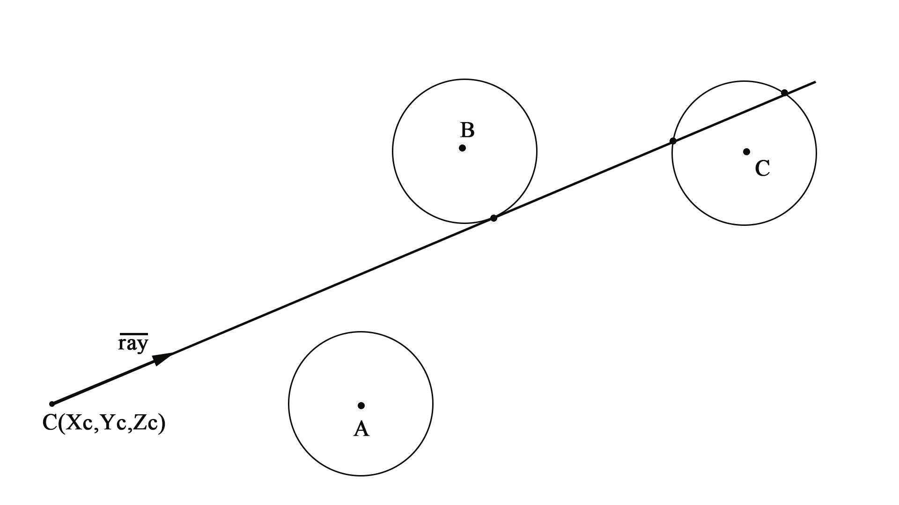
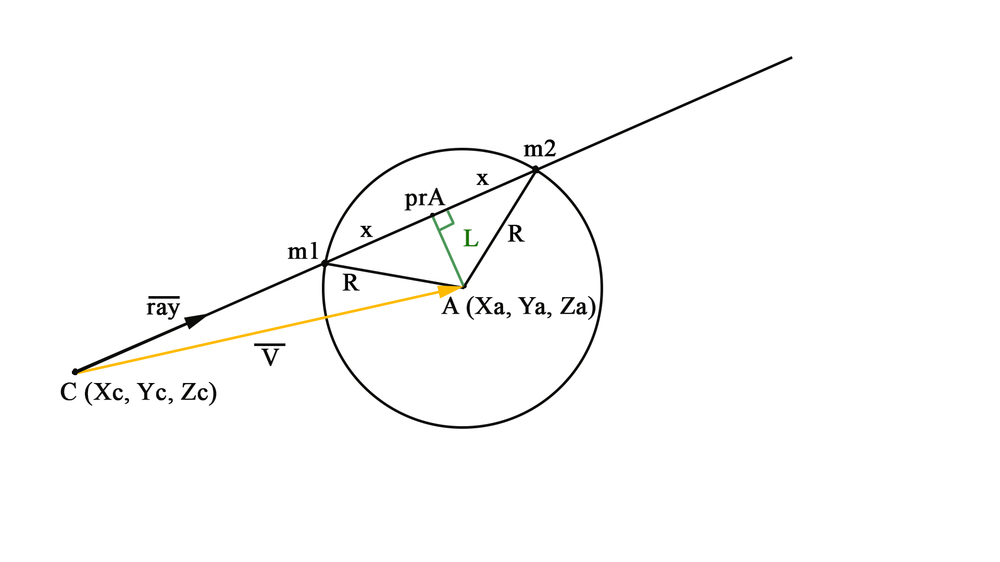
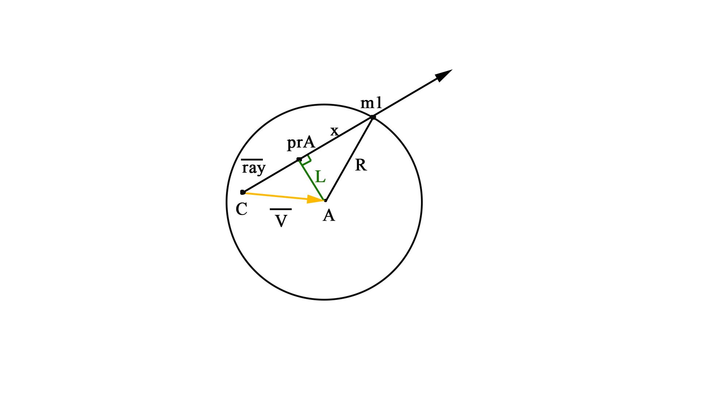

# Результат


# Компиляция

```
g++ -Wall -lm -lncurses ray_tracing.cpp vectors.h objects.h
./a.out
```

# Под капотом
---

А именно разберём математическую сторону вопроса: __проблема о пересечении луча и сферы.__ Для решения этой проблемы достаточно ответить на более простой вопрос __пересекает ли луч окружность?__

Окружность однозначно определяют радиус R и центр O, луч выпущен из точки C в направлении ray (нормализованный направляющий вектор).





Первым делом найдём вектор V - соединяющий центр окружности с начальной точкой луча. 

V = (Xa - Xc, Ya - Yc, Za - Zc)

```
vector3 v = center - camera;
```

Теперь найдём минимальное расстояние от луча до центра сферы, как известно это будет перпендикуляр к лучу. Точка пересечения луча и минимального расстояния (prA) на самом деле является проекцией центра окружности на луч, а расстояние от т.С до неё будет равно проекции вектора V на луч:

prA = ray * v

```
float a = projection(v, ray);
```

Далее находим L - минимальное расстояние от центра окружности до луча, по теореме Пифагора:

L² = |V|² - (prA)²

```
float sq_l = abs_v * abs_v - a * a;
```

Сравниваем L с радиусом R, соответственно:

1. L < R - два пересечения
2. L = R - одно пересечение
3. L > R - пересечений нет

```
if (sq_l > radius * radius) return -1;
```

Осталось найти сами точки пересечения. Проводим два радиуса до точек пересечения и находим некую Х - расстояние от точек пересечения до проекции центра окружности на луч.

X² = R² - L² 

```
float x = sqrt(radius*radius - sq_l);
```

Отсюда расстояния до точек пересечения:

t1 = PrA + x

t2 = PrA - x

А сами точки пересечения можно найти так:

m1 = C + t1 * ray

m2 = C + t2 * ray

```
return vector2(a - x, a + x);
```

Так же стоит рассмотреть ситуацию когда начало луча (точка С) лежит внутри окружности, хоть она и не используется в моей программе.



Отличие лишь в том, что точка пересечения точно будет, но только одна: t = prA + x

Позже нам понадобиться найти нормаль в точке пересечения (для источника света), для сферы это делается очень просто:

normal = m - A

где m - точка пересечения, А - центр сферы.
    
Не забываем нормализовать этот вектор.
